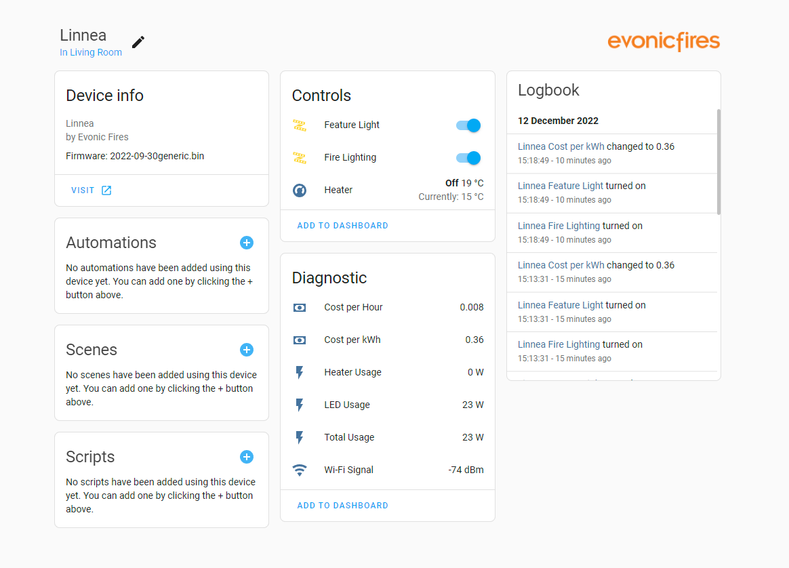

# Evonic Fires

[Home Assistant Community Thread](https://community.home-assistant.io/t/evonic-fires-custom-integration/457118)

Unofficial Evonic Fires integration for bringing your Evonic Fire into Home Assistant.  Also supports electric fires from European Home and Element4

Supports the following features:

- Power On/Off
- Feature Lighting On/Off
- Lighting Effects
- Heater On/Off
- Heater Target Temperature
- Current Ambient Temperature

If you like this component, please give it a star on [github](https://github.com/greghesp/ha-evonic).

##  Supported Fires

This has currently only been tested using the following devices:

- Evonic Linnea
- Evonic E1250

This Custom Component may work for more devices. Please let me know if it supports your fire, or raise an issue or PR

## Usage

Add this repo to the HACS custom repository list in your Home Assistant instance, and install.

As this integration does not use cloud services, there isn't a way to get the device IP address automatically. 
It if therefore recommended giving your fire a static IP address to prevent the connection for breaking in the event the fires IP address changes.

## Release Notes
**0.2.0**
- Fix:  Websocket/API timeout issues where users need to reload integration

**0.1.3**
- Added last ping sensor

**0.1.2**
- Sensor bug fix